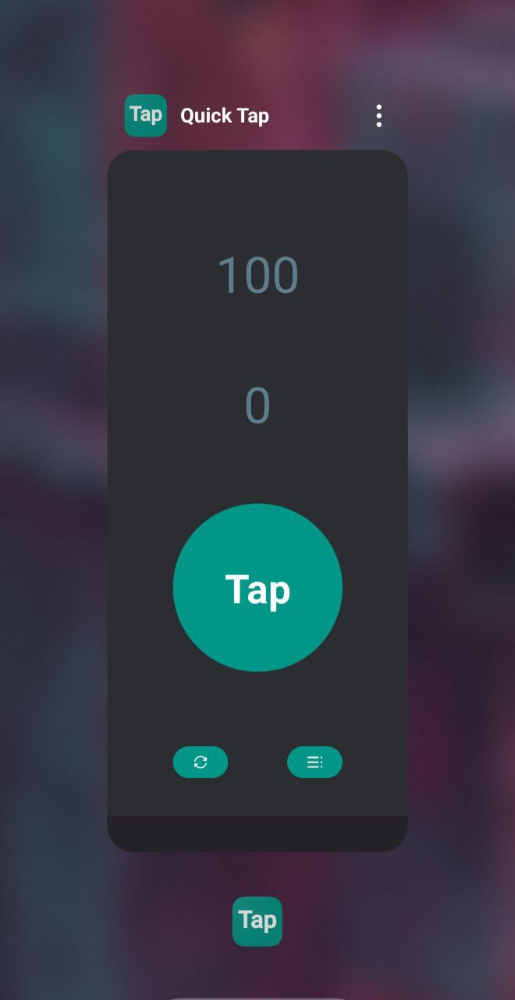
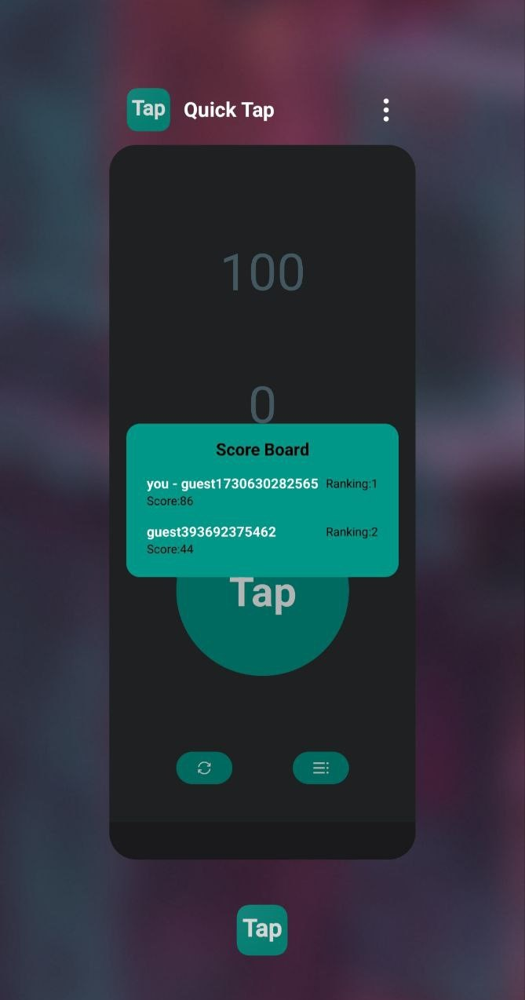

# Quick Tap
Quick Tap is a fast-paced reaction game designed to test players' speed and precision. The objective is simple: tap the button as quickly as possible within a given time limit or number of rounds. Compete against yourself or challenge friends to see who can achieve the highest score or fastest reaction time!

## Features
* Simple Controls: Just tap the button! Designed for players of all ages.
* Speed Challenge: Test your reflexes and challenge yourself to beat your best time.
* Sleek Design: Minimalist and engaging UI, optimized for focus and quick interaction.
* Competitive Mode: Play with friends and see who has the fastest fingers.
* Scoreboard: Track your ranking compared to other players and monitor your own progress over time.

## How to Play
Start a new game and get ready!
Tap the button as quickly as possible within the given time frame or number of rounds.
At the end, see your score or time – try to beat it on your next round!
Check the scoreboard to view your rank and compare your score with other players.

## Technologies Used
* Android Compose: For modern UI design.
* Kotlin: Core language for Android development.
* ConstraintLayout: Ensures a responsive and adaptive layout across devices.

## Requirements
* Android 8.0 (Oreo)+

Get ready to put your reflexes to the test with Quick Tap, and track your performance on the scoreboard!

 

## Google Play
There is currently a build of Quick Tap available on Google Play. https://play.google.com/store/apps/details?id=com.rmrbranco.quicktap
